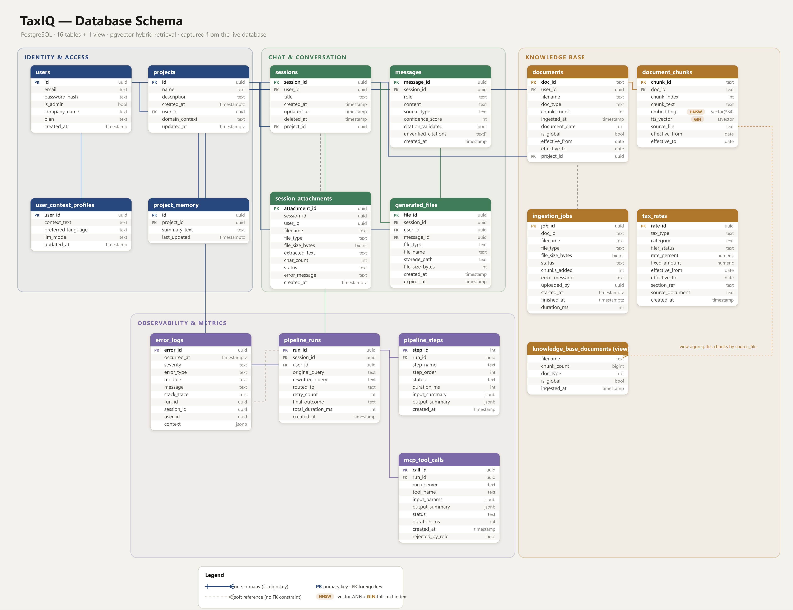

<div align="center">

# TaxIQ

**Pakistan's Tax Code. Answered Instantly.**

_A self-correcting RAG assistant for Pakistani tax professionals — grounded answers with exact statutory citations, structured rate lookups, in-chat file generation, dual-gateway persistence, and full pipeline observability._

[](https://www.python.org/)
[](https://fastapi.tiangolo.com/)
[](https://reactjs.org/)
[](https://vitejs.dev/)
[](https://tailwindcss.com/)
<br/>
[](https://groq.com/)
[](https://deepmind.google/technologies/gemini/)
[](https://www.postgresql.org/)
[](https://supabase.com/)

</div>

---

## Table of Contents

- [Overview](#overview)
- [Key Features](#key-features)
- [Architecture & Pipeline](#architecture--pipeline)
- [Documents: Knowledge Base vs. Chat Attachments](#documents-knowledge-base-vs-chat-attachments)
- [Database Schema](#database-schema)
- [Technology Stack](#technology-stack)
- [Project Structure](#project-structure)
- [Setup & Installation](#setup--installation)
- [Configuration](#configuration)
- [API Reference](#api-reference)
- [Admin Dashboard](#admin-dashboard)
- [Design System](#design-system)

---

## Overview

TaxIQ is a specialized RAG assistant built for Pakistani accounting firms, in-house finance teams, solo consultants, and Chartered Accountants. Ask any question about FBR regulations, Sales Tax, Income Tax, or provincial levies — in Urdu or English — and get a grounded answer with the statutory section it came from.

**TaxIQ does not guess.** If an answer is not supported by the retrieved documents, structured rate data, or a credible web source, it says so rather than fabricating a citation.

Every query runs through a multi-step agentic pipeline: the question is rewritten using conversation context, routed to the right data source, expanded into alternate phrasings, retrieved against, re-ranked, and evaluated for sufficiency — retrying with an improved query if the first attempt falls short — while a live trace of each step streams to the UI.

---

## Key Features

### 1. Multi-step agentic pipeline

Distinct LLM roles, each with its own externalized prompt: query rewriting, routing, query expansion, relevance evaluation, and grounded response generation. See [Architecture & Pipeline](#architecture--pipeline).

### 2. Four-way routing

Every query is classified into exactly one path:

- **DIRECT** — greetings, meta-questions, and anything not requiring tax evidence. Short conversational messages skip the router LLM entirely via a fast-path.
- **RAG** — hybrid search over the ingested tax corpus.
- **WEB** — live web search for current information (provincial levies, recent FBR announcements), via Tavily with a Gemini grounded-search fallback.
- **SQL** — deterministic lookups against a maintained `tax_rates` table through an MCP tool call. Falls back to RAG automatically if no rows match or the MCP process fails.

### 3. Hybrid retrieval with RRF

Retrieval fuses two signals:

- **Semantic** — pgvector cosine similarity over `document_chunks.embedding`.
- **Keyword** — Postgres full-text search (`tsvector` / `websearch_to_tsquery`) in direct mode; BM25 (`rank-bm25`) is applied over the retrieved candidate set in-process.

Results are merged with **Reciprocal Rank Fusion** (`score = Σ 1 / (k + rank)`, k = 60) and truncated to `TOP_K_RERANK`.

### 4. Query expansion

Before retrieval, the query is expanded into `n=2` alternate phrasings (synonyms, statutory vs. plain-language wording). All variants are embedded and searched in parallel, then de-duplicated — this materially improves recall on legal text, where the same rule is described in several vocabularies.

### 5. Self-correcting retry loop

When the relevance evaluator judges the retrieved evidence insufficient, its specific feedback is fed back into the rewriter, which produces a targeted new query for another attempt (up to `MAX_RETRIES`). When retries are exhausted, the system falls back to a grounded web search, and only then to an honest "not enough information" response.

### 6. In-chat file generation

Ask for an answer "as an Excel file" (or Word/PDF) and TaxIQ structures the generated answer into a JSON payload, builds the real file, and returns a download card. Ragged LLM tables are normalized and XML-special characters escaped before the file is built; failures surface in the chat rather than silently producing nothing.

### 7. Chat attachments (per-conversation)

Users can attach a file to a single conversation from the composer. Its text is extracted once and injected into that conversation's prompt. It is **never embedded and never enters the shared knowledge base**. See [Documents](#documents-knowledge-base-vs-chat-attachments).

### 8. Admin-managed knowledge base

Knowledge-base ingestion is an admin function. Uploads are chunked, embedded, and written into the same `document_chunks` table retrieval reads, with per-document status (processing / success / failed) tracked and shown.

### 9. Multi-format ingestion

A unified pipeline normalizes every input into `{ text, metadata, doc_id }` before chunking (size 512, overlap 64) and embedding:

| Format          | Loader                                                              |
| --------------- | ------------------------------------------------------------------- |
| `.txt`, `.md`   | Direct read                                                         |
| `.pdf`          | PyMuPDF page-by-page; falls back to Gemini Vision for scanned pages |
| `.csv`, `.xlsx` | Pandas / OpenPyXL row-to-text, headers carried into each chunk      |
| `.html`         | BeautifulSoup4 structural extraction                                |
| `.docx`         | Paragraph + table extraction                                        |
| Images          | Gemini Vision for charts and embedded text                          |

### 10. Projects and memory

Chats can be scoped to a **Project**, which carries an injected static `domain_context` and a rolling **project memory** — a summary updated in the background after each exchange, carrying facts forward into later chats.

### 11. Personalization

A per-user profile (`context_text`, `preferred_language`, `llm_mode`) is applied to **every** answer path — DIRECT, RAG, SQL, and WEB — not only the grounded RAG response.

### 12. Live pipeline trace

Every step streams to the UI over Server-Sent Events. The chat shows a human-readable status ("Searching the knowledge base", "Reading results") that collapses into an expandable reasoning trail once the answer starts streaming; the right-hand panel shows the engineer's view with per-step timings and retry counts.

---

## Architecture & Pipeline

```text
USER QUERY
    │
    ▼
Load conversation history + project context + chat attachments
    │
    ▼
[LLM 1] QUERY REWRITER — resolve pronouns, translate to English, make standalone
    │
    ▼
[LLM 2] ROUTER — { route: DIRECT | RAG | WEB | SQL, output_format: chat | file_* }
    │        (short conversational messages fast-path to DIRECT without an LLM call)
    │
    ├── DIRECT → answer from general knowledge (+ user context, language, attachments)
    │
    ├── RAG    → [LLM 3] QUERY EXPANDER (n=2 alternate phrasings)
    │            → embed all variants → pgvector search (parallel) + keyword search
    │            → BM25 over candidates → RRF re-rank (k=60) → top-K
    │            → [LLM 4] RELEVANCE EVALUATOR → { relevant: bool, reason: str }
    │                 │
    │                 ├── relevant → generate grounded answer
    │                 └── not relevant → retry loop (feedback-improved query)
    │                       └── retries exhausted → grounded web search → safe response
    │
    ├── WEB    → Tavily search → (on failure) Gemini grounded search
    │
    └── SQL    → [LLM] parameter extraction → MCP Postgres tool → tax_rates
                 → no rows / MCP failure → automatic fallback to RAG
    │
    ▼ (all paths converge)
[LLM 5] RESPONSE GENERATOR — streams tokens; answers only from provided evidence
    │
    ▼
Persist: messages, pipeline_runs, pipeline_steps  ·  update project memory (background)
    │
    ▼
output_format == file_pdf | file_xlsx | file_docx ?
    │ no                                  │ yes
    ▼                                     ▼
Return chat response            [LLM 6] FILE STRUCTURER → build PDF/XLSX/DOCX
                                          → store + return a download card
```

---

## Documents: Knowledge Base vs. Chat Attachments

Two ways a document can enter TaxIQ. They are deliberately separate systems, and the separation is **structural, not a filter**.

|                | **Knowledge base**                             | **Chat attachment**              |
| -------------- | ---------------------------------------------- | -------------------------------- |
| Added by       | Admin, from the admin panel                    | Any user, from the chat composer |
| Processing     | Chunked → embedded → indexed                   | Text extracted once              |
| Stored in      | `document_chunks` (+ `documents`)              | `session_attachments`            |
| Retrievable by | **Everyone** — it answers all users' questions | Only that one conversation       |
| Lifetime       | Permanent, shared                              | Dies with the conversation       |
| Endpoint       | `POST /api/admin/kb/upload`                    | `POST /api/attachments`          |

An attachment cannot leak into another user's answer because it is never written to the table retrieval reads. Its text reaches the model only through the prompt of its own conversation, clearly labelled as user-supplied and not part of the tax code, and capped so a large PDF cannot crowd out retrieved statutes.

Full detail: [`docs/INGESTION.md`](docs/INGESTION.md).

---

## Database Schema

PostgreSQL (Supabase-hosted), with vector and full-text search both native via `pgvector`. 16 tables and 1 view, grouped into four domains: identity/access, chat/conversation, knowledge base, and observability/metrics.



_Full ER diagram with every column, type, key, and relationship — generated directly from the live database (`scripts/build_erd.py`; a column snapshot is in [`docs/schema-snapshot.json`](docs/schema-snapshot.json)). A vector SVG is at [`docs/database-schema.svg`](docs/database-schema.svg)._

Relationship overview (crow's-foot `<` = the many side):

```text
users ──┬──< sessions ──┬──< messages ──< generated_files
        │               ├──< pipeline_runs ──┬──< pipeline_steps
        │               │                    └──< mcp_tool_calls
        │               └──< generated_files
        ├──< projects ──┬──< sessions (project_id)
        │               ├──< project_memory
        │               └──< documents (project_id)
        ├──< documents ──< document_chunks
        ├──< pipeline_runs (user_id)
        └──o user_context_profiles          (1:1 — user_id is the PK)

Decoupled by design (no FK constraint — shown dashed in the diagram):
  session_attachments  ~ sessions/users   -- per-conversation files, never in the KB
  error_logs           ~ runs/sessions/users
  ingestion_jobs       ~ documents

Standalone:
  tax_rates                        -- structured rates, queried on the SQL route via MCP
  knowledge_base_documents (view)  -- chunks per document, grouped by source_file
```

**Key tables & indexes**

- **`pipeline_runs` / `pipeline_steps`** — one row per query, child rows per step, with durations. These power the trace panel and every latency chart.
- **`document_chunks`** — `embedding` (`vector(384)`) + `fts_vector` drive hybrid retrieval. Two indexes matter here: an **HNSW** index on `embedding` (approximate vector search) and a **GIN** index on `fts_vector` (full-text). Both are marked in the diagram. The embedding param **must** be cast to `::vector` in queries or the HNSW index is bypassed (≈740ms → ≈1ms).
- **`session_attachments`** — deliberately has **no** foreign key to `sessions`. Attachments are per-conversation prompt context, not knowledge-base rows, and the missing constraint is the structural guarantee that they can never be joined into shared retrieval.
- **`error_logs` / `ingestion_jobs`** — added by migration 003; back the admin error history and ingestion status.

Migrations live in two places:

- `alembic/` — the original SQLAlchemy migration chain.
- `migrations/*.sql` — plain SQL, applied by pasting into the Supabase SQL editor or via `python scripts/apply_migration.py <file>`. This path exists because DDL cannot be issued over the Supabase REST API, so on IPv4-only networks the SQL editor is the only route.

---

## Technology Stack

### Backend

| Layer           | Technology                                                                  |
| --------------- | --------------------------------------------------------------------------- |
| Framework       | FastAPI (async), Uvicorn                                                    |
| Database        | PostgreSQL / Supabase, `pgvector`                                           |
| Data access     | Async SQLAlchemy + asyncpg (direct) · Supabase REST (fallback)              |
| Keyword search  | Postgres `tsvector` · `rank-bm25`                                           |
| Migrations      | Alembic · plain SQL (`migrations/`)                                         |
| Structured data | Model Context Protocol (MCP) Postgres server                                |
| Auth            | JWT in an HttpOnly cookie + double-submit CSRF, bcrypt, slowapi rate limits |

### AI

| Role                        | Provider                                                         |
| --------------------------- | ---------------------------------------------------------------- |
| Primary inference           | Groq — LLaMA 3.3 70B Versatile                                   |
| Fallback inference & vision | Google Gemini (`gemini-2.5-flash`)                               |
| Grounded web search         | Tavily, with Gemini Google-Search grounding as fallback          |
| Embeddings                  | Local sentence-transformer, 384-dim (`EMBEDDING_PROVIDER=local`) |
| Optional local LLM          | Any OpenAI-compatible endpoint via `LOCAL_LLM_URL`               |

API keys are rotated automatically on rate-limit (`src/llm/key_manager.py`), so `GROQ_API_KEY_1..n` / `GEMINI_API_KEY_1..n` can be supplied.

### Frontend

| Layer        | Technology                                                       |
| ------------ | ---------------------------------------------------------------- |
| Framework    | React 19 · TypeScript · Vite                                     |
| Styling      | Tailwind CSS, token-driven (see [Design System](#design-system)) |
| State        | Zustand                                                          |
| Realtime     | Server-Sent Events                                               |
| Admin charts | Recharts                                                         |

---

## Project Structure

```text
taxiq/
├── admin-frontend/       # Admin dashboard (React, plain CSS, Recharts)
├── alembic/              # SQLAlchemy migration chain
├── archive/              # One-off scripts and superseded docs (gitignored)
├── data/
│   ├── documents/        # Source files for the knowledge base
│   └── generated/        # AI-generated PDF/XLSX/DOCX output
├── docs/                 # DESIGN.md, INGESTION.md
├── frontend/             # Main chat app (React, Tailwind, Zustand)
│   └── public/brand/     # Logo assets (SVG)
├── mcp-servers/          # MCP server configuration
├── migrations/           # Plain-SQL migrations (Supabase-runnable)
├── prompts/              # All LLM system prompts, externalized
├── scripts/              # Ingestion, migration, and maintenance utilities
├── src/
│   ├── api/              # Routes: sessions, profile, projects, admin, attachments
│   ├── auth/             # JWT, CSRF, password hashing, rate limiting
│   ├── data_gateway/     # DataGateway protocol + direct and REST backends
│   ├── database/         # SQLAlchemy models, Postgres engine, pipeline logger
│   ├── generation/       # PDF / XLSX / DOCX builders
│   ├── ingestion/        # Loaders, chunker, ingestion service
│   ├── llm/              # Provider clients, key rotation, tool definitions
│   ├── mcp/              # MCP client for the SQL route
│   ├── memory/           # Conversation persistence
│   ├── observability/    # Error capture + analytics aggregation
│   ├── pipeline/         # Orchestrator and every pipeline stage
│   └── retrieval/        # Embedder, vector store, BM25, RRF re-ranker
├── tests/                # Pytest suite (no network access)
├── docker-compose.yml    # Local Postgres + pgvector
└── requirements.txt
```

---

## Setup & Installation

### Prerequisites

- Python 3.11+
- Node.js 20+
- PostgreSQL with `pgvector` (Supabase provides this, or use `docker-compose.yml`)

### 1. Backend

```bash
git clone <repo-url>
cd taxiq

python -m venv .venv
source .venv/bin/activate        # Windows: .venv\Scripts\activate
pip install -r requirements.txt

cp .env.example .env             # then fill in the values below
```

### 2. Database

```bash
docker compose up -d             # local Postgres only; skip if using Supabase
alembic upgrade head
```

Then apply the SQL migrations that are not in the Alembic chain:

```bash
python scripts/apply_migration.py migrations/003_admin_dashboard_and_attachments.sql
```

If the direct Postgres connection is blocked on your network (common on IPv4-only ISPs), paste that file into the **Supabase SQL editor** instead — DDL cannot be issued over the REST API.

Migration 003 adds `error_logs`, `ingestion_jobs`, `session_attachments`, and the `knowledge_base_documents` view. Until it is applied the app runs normally, but chat attachments are disabled (with an explicit message) and the admin dashboard shows an "instrumentation not applied" banner instead of empty charts.

### 3. Run

```bash
uvicorn src.main:app --reload            # API      → http://localhost:8000

cd frontend && npm install && npm run dev        # Chat app  → http://localhost:5173
cd admin-frontend && npm install && npm run dev  # Admin app → http://localhost:5174
```

The admin app proxies `/api` to `http://127.0.0.1:8000`. An account must have `is_admin = true` to reach it.

### 4. Populate the knowledge base

Upload documents from the admin panel (**Knowledge Base → drop files**), or place files in `data/documents/` and use the scripts in `scripts/` for bulk ingestion.

---

## Configuration

Key `.env` values (see `.env.example` for the full list):

| Variable                                    | Purpose                                                    | Default      |
| ------------------------------------------- | ---------------------------------------------------------- | ------------ |
| `LLM_PROVIDER`                              | Primary chat model (`groq` \| `gemini`)                    | `gemini`     |
| `GROQ_API_KEY`, `GEMINI_API_KEY`            | Provider keys (`_1..n` suffixes enable rotation)           | —            |
| `EMBEDDING_PROVIDER`                        | `local` (384-dim) \| `gemini`                              | `gemini`     |
| `DATABASE_URL`                              | Postgres connection (asyncpg)                              | —            |
| `SUPABASE_URL`, `SUPABASE_SERVICE_ROLE_KEY` | Required for REST mode                                     | —            |
| `DB_ACCESS_MODE`                            | `direct` \| `rest` \| `auto` (`direct` falls back to REST) | `auto`       |
| `TAVILY_API_KEY`                            | Web-search route                                           | —            |
| `MAX_RETRIES`                               | Retrieval retry budget                                     | `1`          |
| `TOP_K_RETRIEVAL` / `TOP_K_RERANK`          | Candidates retrieved / kept after RRF                      | `10` / `5`   |
| `CHUNK_SIZE` / `CHUNK_OVERLAP`              | Chunking                                                   | `512` / `64` |
| `LOCAL_LLM_URL`                             | Optional OpenAI-compatible endpoint; empty disables it     | _(empty)_    |

> **Please confirm:** `MEMORY_BACKEND` is still read by `src/config.py`, but conversation history always persists through the data gateway (Postgres). The JSON-file memory path in `src/memory/conversation.py` is dead code. Recommend removing both.

---

## API Reference

All routes are under `/api`. Authentication is a JWT in an HttpOnly cookie; mutating requests require the `X-CSRF-Token` double-submit header.

### Auth

| Endpoint                                       | Purpose                                      |
| ---------------------------------------------- | -------------------------------------------- |
| `POST /api/auth/register` · `login` · `logout` | Account and session lifecycle (rate-limited) |
| `GET /api/auth/me`                             | Current user, including `is_admin`           |

### Chat

| Endpoint                                                    | Purpose                                                             |
| ----------------------------------------------------------- | ------------------------------------------------------------------- |
| `POST /api/chat`                                            | Send a message; streams the pipeline trace and answer as SSE        |
| `GET /api/sessions` · `GET/PATCH/DELETE /api/sessions/{id}` | Session list, history, rename, soft-delete                          |
| `GET /api/sessions/{id}/export`                             | Export a chat (`?format=json\|md\|pdf`)                             |
| `GET /api/files/{file_id}/download`                         | Download a generated file (ownership-checked; admins may fetch any) |

### Attachments (per-conversation)

| Endpoint                                                            | Purpose                                       |
| ------------------------------------------------------------------- | --------------------------------------------- |
| `POST /api/attachments`                                             | Attach a file to one conversation (multipart) |
| `GET /api/attachments?session_id=` · `DELETE /api/attachments/{id}` | List / remove                                 |

### Projects & profile

| Endpoint                            | Purpose                                      |
| ----------------------------------- | -------------------------------------------- |
| `GET/POST/PUT/DELETE /api/projects` | Project CRUD, scoped to the owner            |
| `GET/PUT /api/profile`              | User context, preferred language, model mode |

### Admin (`is_admin` required)

| Endpoint                                                                        | Purpose                                                     |
| ------------------------------------------------------------------------------- | ----------------------------------------------------------- |
| `GET /api/admin/metrics`                                                        | Totals for the summary cards                                |
| `GET /api/admin/usage`                                                          | Requests over time + routing breakdown                      |
| `GET /api/admin/latency`                                                        | avg / p50 / p95, trend, per-route and **per pipeline step** |
| `GET /api/admin/errors` · `GET /api/admin/errors/trend`                         | Filterable error history and trend                          |
| `GET /api/admin/kb/stats` · `GET /api/admin/kb/jobs`                            | Chunks indexed, chunks per document, ingestion status       |
| `POST /api/admin/kb/upload`                                                     | Upload a document into the shared knowledge base            |
| `DELETE /api/admin/kb/documents/{source_file}`                                  | Remove a document and its chunks                            |
| `GET /api/admin/instrumentation`                                                | Which observability tables exist                            |
| `GET /api/admin/runs` · `/runs/{id}/steps` · `/mcp-calls` · `/files` · `/users` | Operational views                                           |

---

## Admin Dashboard

A separate React app (`admin-frontend/`) on the `/api/admin/*` namespace, gated by `is_admin`. Every figure is computed from real rows — nothing is placeholder.

| Page                | Contents                                                                                                                                                                                                                                                                                                                                                                                  |
| ------------------- | ----------------------------------------------------------------------------------------------------------------------------------------------------------------------------------------------------------------------------------------------------------------------------------------------------------------------------------------------------------------------------------------- |
| **Dashboard**       | Summary cards (requests, median/p95 latency, chunks indexed, errors, slowest step); requests-over-time area chart; routing donut; requests-by-route trend + table (count, share, answered %, avg, p95); latency trend (avg vs p95); **where the time goes** — average duration per pipeline step; per-step table with p50/p95/max and failure counts; errors-over-time; largest documents |
| **Knowledge Base**  | Drag-and-drop upload into the shared corpus; per-document ingestion status (processing / success / failed, with the failure reason); document list with chunk counts and delete; chunks-per-document chart                                                                                                                                                                                |
| **Errors**          | Filterable history (severity, module, exception type, free-text search) with expandable stack traces and the originating `run_id`; errors-over-time trend by severity                                                                                                                                                                                                                     |
| **Run History**     | Past pipeline runs, expandable into their step-by-step trace                                                                                                                                                                                                                                                                                                                              |
| **MCP Calls**       | Tool-call log for the SQL route                                                                                                                                                                                                                                                                                                                                                           |
| **Generated Files** | Audit and delete AI-generated documents                                                                                                                                                                                                                                                                                                                                                   |
| **Users**           | Registered accounts                                                                                                                                                                                                                                                                                                                                                                       |

All views share a date-range filter (24h / 7d / 30d / 90d), which also switches bucketing between hourly and daily. Percentiles are nearest-rank, so a reported p95 is a latency a real request actually experienced.

---

## Design System

Both frontends share one token set (`frontend/src/index.css`, mirrored in `admin-frontend/src/index.css`). Rationale in [`docs/DESIGN.md`](docs/DESIGN.md).

- **Surfaces:** warm off-white (`#F4F2ED` canvas, `#FFFFFF` cards). Warm neutrals, not blue-grays.
- **Accent:** ink navy `#27477D` — the only saturated colour in the system, reserved for primary buttons, active nav/pipeline items, links, focus rings, and in-progress indicators. Roughly 95% of the UI is neutral; the accent means something because it is rare.
- **Dark mode:** warm charcoal; the accent lightens to `#7FA3DC` so it stays legible.
- **Type:** Inter. **Radii:** 6–20px. **Shadows:** soft and warm-tinted.
- **Motion:** phase icons animate the part that carries meaning (a search sweep, a pen stroke), not a generic spinner. All motion is disabled under `prefers-reduced-motion`.
- **Logo:** a four-point spark on a navy tile, with one squared corner suggesting a page. Icon, glyph, and horizontal lockup variants (light and dark) in `frontend/public/brand/`.

No component carries a raw hex value; a theme change is a change to the token file.

---

<div align="center">

Built to prioritize **accuracy over speed** and **transparency over black-box magic.**

</div>
