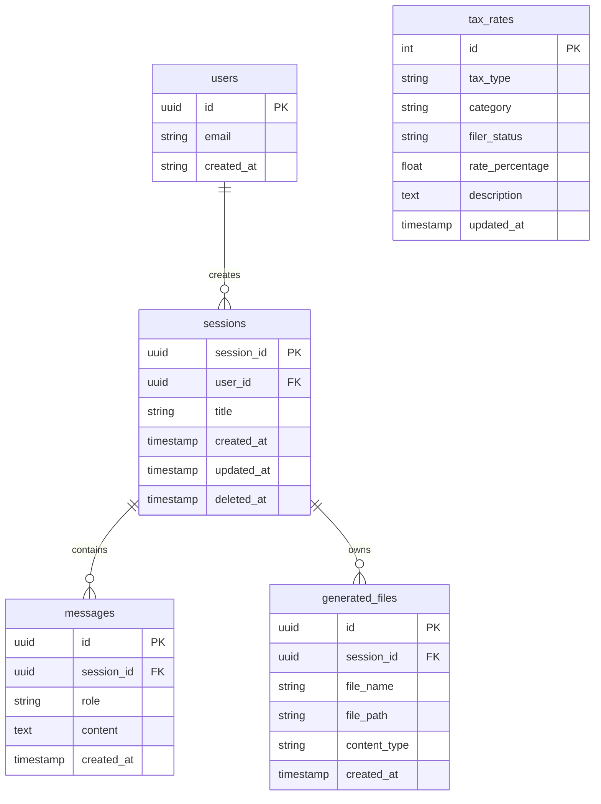

# Database Design

This document details the Supabase PostgreSQL database schema powering the RAG Chatbot.

## Schema Overview

The database contains core tables responsible for managing user accounts, chat session histories, and the structured tax rate data accessed by the SQL retrieval pipeline.

### Mermaid ERD

## Table Definitions

### `users`
Managed by Supabase Auth (or mapped directly). Stores essential user identities.
- `id`: UUID (Primary Key)
- `email`: User email address

### `sessions`
Groups a series of messages into a distinct chat thread.
- `session_id`: UUID (Primary Key)
- `user_id`: UUID linking to `users.id`
- `title`: The display name of the chat session
- `created_at`: Timestamp
- `updated_at`: Timestamp for ordering the sidebar
- `deleted_at`: Soft-delete timestamp used to hide deleted sessions.

### `messages`
The individual dialog turns (user inputs, assistant responses, and tool calls) within a session.
- `id`: UUID (Primary Key)
- `session_id`: UUID linking to `sessions.session_id`
- `role`: The speaker role (`user`, `assistant`, `system`, `tool`)
- `content`: The raw text content of the message
- `created_at`: Chronological ordering timestamp

### `generated_files`
Tracks artifacts generated during a chat session (e.g. Exported PDFs, Data Analysis CSVs).
- `id`: UUID
- `session_id`: The parent session where the file was generated.
- `file_path`: Where the file is stored locally or in Supabase Storage.

### `tax_rates`
A standalone data table specifically tailored for structured querying by the SQL pipeline router.
- `tax_type`: Broad classification (e.g., 'Income', 'Corporate')
- `category`: Sub-classification (e.g., 'Capital Gains', 'State Tax')
- `filer_status`: The individual or business entity status (e.g., 'Single', 'Married Filing Jointly')
- `rate_percentage`: The specific percentage rate
- `description`: Plain-text explanation of the rate limits or rules
